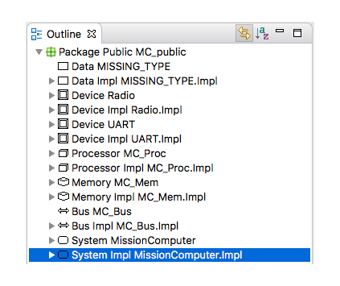

# Github hosted Sireum ACT Plugin Update Site

## Installation
1. Install and launch [OSATE](http://osate.org/download-and-install.html)
2. Navigate to ``Help > Install New Software ...``
3. Click ``Add...`` and in the ``Location:`` field paste the following URL

    https://raw.githubusercontent.com/sireum/act-plugin-update-site/master/org.sireum.aadl.osate.update.site.act/site.xml
  
4. Check the box for ``Sireum ACT Plugin`` and click ``Finish``

## Usage
1. Select a system implementation from OSATE's outline view.

  
  
2. If CASE is installed, choose ``CASE`` from the menu bar and then ``System Build > Generate CAmkES``. Otherwise choose ``OSATE`` from the menu bar and then ``Sireum Bridge > Generate CAmkES``.

3. Select an output directory and click ``Run``.
